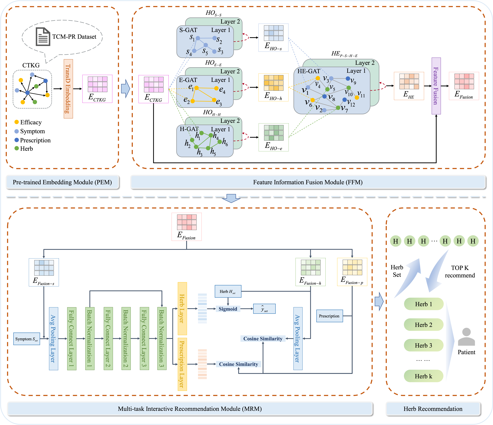
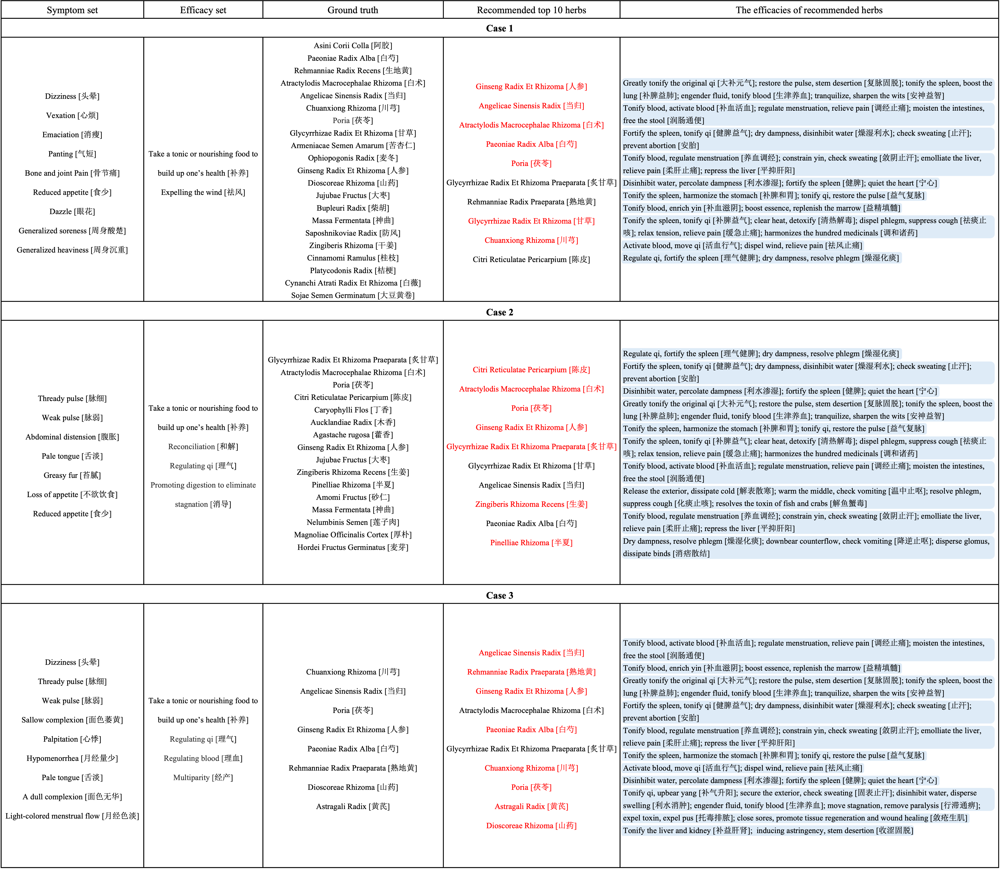

# GMHR: Knowledge-Driven Approach Integrating Graph Attention Networks and Multi-Task Learning for Herb Recommendation

## Overview

GMHR is a knowledge-driven framework for TCM herb recommendation. It combines knowledge graph embeddings with homogeneous and heterogeneous graph modeling to capture both explicit and implicit relationships among symptoms, efficacies, herbs, and herb-combination semantics. GMHR further improves recommendation accuracy and robustness via multi-task learning with two auxiliary objectives, prescription prediction and semantic alignment.

We also construct a new dataset, TCM-PR, which augments symptom–herb records with efficacy annotations and uses prescription names to represent holistic herb combinations, enabling a more comprehensive study of herb recommendation. Due to privacy constraints, we release a partially processed subset of the dataset for research use.




## Entity Types

| Type | Prefix | Description | Example |
|------|--------|-------------|---------|
| Prescription | `Prescription_` | TCM prescription name | `Prescription_1` |
| Component | `Component_` | Herb/ingredient | `Component_176` |
| Efficacy | `Efficacy_` | Therapeutic function | `Efficacy_3` |
| Symptom | `Symptom_` | Clinical symptom | `Symptom_42` |

## Relation Types

| Relation | Head Entity | Tail Entity |
|----------|-------------|-------------|
| `Symptom-to-Prescription` | Symptom | Prescription |
| `Function-to-Prescription` | Efficacy | Prescription |
| `Component-to-Prescription` | Component | Prescription |
| `Prescription-to-Component` | Prescription | Component |
| `Prescription-to-Function` | Prescription | Efficacy |
| `Prescription-to-Symptom` | Prescription | Symptom |

## Installation

### Requirements

- Python >= 3.8
- PyTorch >= 1.12
- PyTorch Geometric
- PyKEEN
- NetworkX
- pandas
- numpy
- matplotlib
- scikit-learn
- tqdm
- openpyxl


## Usage

### Step 1: Train TransD Knowledge Graph Embeddings

```bash
python KG_Tran.py
```

### Step 2: Build Co-occurrence Graphs and Train GAT

```bash
cd TCM_PR
python Main.py
```


### Step 3: Train GMHR Recommendation Model

```bash
python GMHR.py
```

## Case

We provide case studies of GMHR’s herb recommendations.


